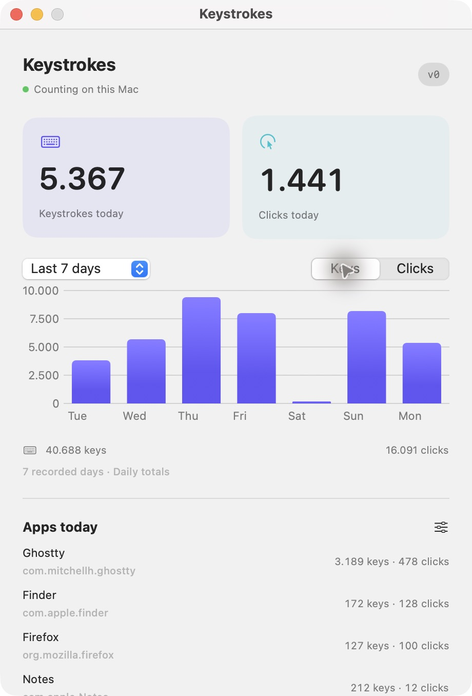
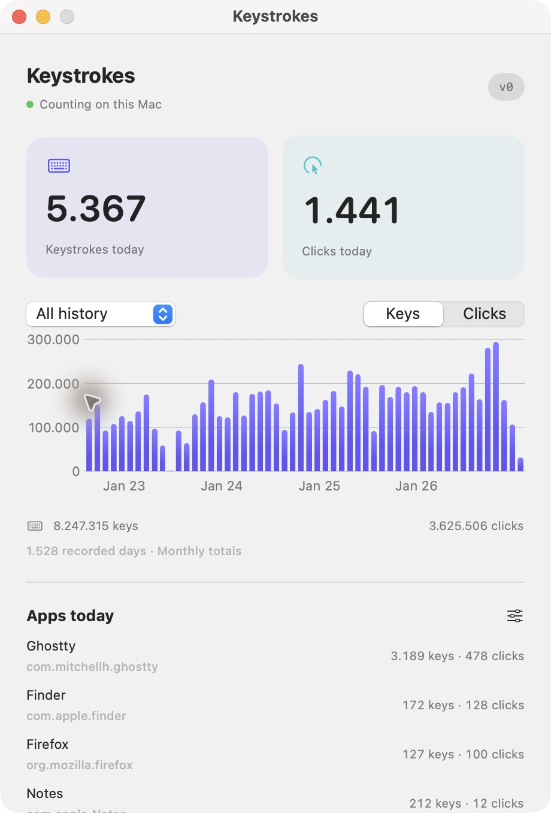
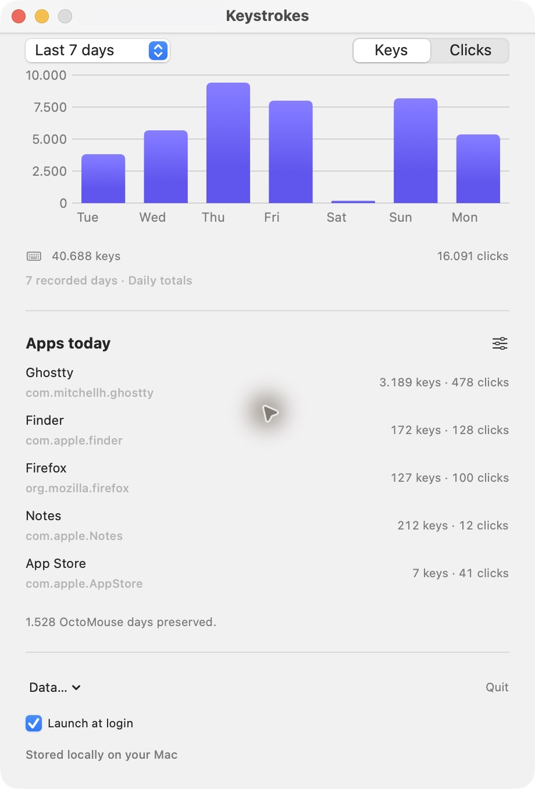

# Keystrokes v0

Native macOS menu bar counter. Swift + SwiftUI + SQLite. macOS 14+.


An independent alternative to [OctoMouse](https://github.com/KonsomeJona/OctoMouse), with migration of its daily history. Early v0, built from source; no signed/notarized installer yet. Builds for the current Mac's architecture, including native Apple Silicon. Runtime verified on an Apple Silicon Mac; Intel and macOS 14 are not yet independently tested.

## Screenshots

Menu bar counter:


Dashboard: today's keys and clicks, selectable history ranges, period totals and counts per app.



<details>
<summary>Explore all recorded history</summary>



</details>

<details>
<summary>App statistics and controls</summary>



</details>

## Run

Requires macOS 14+ and Swift 6+. Install Apple's Command Line Tools if needed:

```sh
xcode-select --install
```

Clone and run in Terminal; no full Xcode installation needed:

```sh
git clone https://github.com/MiKatre/keystrokes.git
cd keystrokes
./run.sh
```

After cloning, **Keystrokes.command** is also a double-click launcher.

First build takes longer. Later builds reuse the compiler cache. A dashboard window opens on launch. Click the activity icon and number in the menu bar to open its popover. The dashboard window temporarily shows a Dock icon; closing it hides that icon and keeps the menu bar counter running. Use **Quit** to stop the app. Double-clicking the app again opens the dashboard window.

Enable **Keystrokes** in **System Settings → Privacy & Security → Input Monitoring**, using the dashboard button. If macOS asks to quit and reopen, quit Keystrokes and open the installed `Keystrokes.app` (or run `./run.sh` again).

If the switch is on but the app still says permission is needed after a rebuild: remove **only Keystrokes** from that list, add the installed `Keystrokes.app` again, and enable it. macOS can retain a permission tied to an older local build's signing fingerprint. The dashboard says **Counting on this Mac** when monitoring is ready.

The launcher builds `dist/Keystrokes.app` and installs a copy in `~/Applications` (or updates an existing `/Applications/Keystrokes.app` with the same bundle identifier). Open the installed app with Spotlight or Finder for subsequent launches; recompilation is only needed after source changes. `./run.sh` also reopens the app if it is already running. Quit before rebuilding after source changes. Builds target the current Mac's architecture. These are locally signed development builds. After rebuilding, macOS may require re-enabling Input Monitoring. A process lock prevents two app copies from counting simultaneously.

## v0

- Keystrokes and mouse clicks; held-key repeats ignored, matching OctoMouse.
- Today plus 7-day, 30-day, last-12-month and all-history charts with period totals. Daily bars for 7/30 days, weekly for the last 12 months, monthly for all history. Defaults to seven days.
- Foreground app counts; comma-separated bundle-ID exclusions.
- Opt-in launch at login; first launch asks, dashboard checkbox changes it later.
- Automatic read-only OctoMouse migration through the launcher, before collecting new input.
- Daily CSV export; portable SQLite database in `~/Library/Application Support/Keystrokes/stats.sqlite`.

No network requests. No typed text, clipboard contents, audio or URLs recorded. Counts save once per second and on normal quit. An abrupt crash can lose the last second of input. Secure input fields and other macOS restrictions can prevent observing keystrokes. Counts describe observed key-down events, not words; synthetic input may also produce events.

## Migration

Source: `~/Library/Containers/com.takohi.octomouse/Data/Library/Preferences/com.takohi.octomouse.plist`. The launcher reads this one file using the terminal's existing access; the GUI also attempts the import if it can access it. If macOS blocks direct access, select the source with **Data → Import OctoMouse…**. OctoMouse saves periodically; migration reads its last saved snapshot.

All daily fields preserved in each imported row's `legacy_json`: counts, elapsed seconds, per-key histogram, mouse distance, scrolling, initialization date. Imported daily keys/clicks power the dashboard; historical app breakdowns unavailable. The separate OctoMouse global counter is not added to daily totals.

Imported dates are frozen. Re-import fills missing dates only and skips dates already collected by Keystrokes. This prevents double-counting when OctoMouse keeps running. Today's baseline is captured before v0 starts collecting. **Data → Import OctoMouse…** selects another preferences file. CSV imports are not implemented in v0.

CSV export contains daily key/click totals for all recorded days, regardless of the selected chart range. To move the complete database, quit Keystrokes and copy `stats.sqlite` plus any remaining `stats.sqlite-wal` / `stats.sqlite-shm` files into the same Application Support directory on the other Mac. Use **Data → Show database in Finder** to locate it.

App exclusions apply to future events; imported history stays intact. V0 excludes its own UI. Browser URL tracking, dictation, active-time tracking, mouse-distance display and packaged distribution are deferred.

## Retiring OctoMouse

Keystrokes collects input independently; OctoMouse is not a runtime dependency. Before the first import, quit OctoMouse normally so it saves its latest totals. Keep a copy of its preferences file outside its container before uninstalling it. Confirm imported history, **Counting on this Mac**, your desired **Launch at login** setting, and new saved counts with OctoMouse closed before removing it.

Re-import does not reconcile the current day after parallel collection. Input during the initial build or permission setup can be missed; v0 has no automatic final-handover reconciliation or backup feature. To back up Keystrokes, quit it and copy its database and any remaining WAL/SHM files as described above. Keep both backups outside OctoMouse's container.

## Launch at login

First launch asks **Start Keystrokes at login?** Choose **Enable** or **Not now**. The dashboard's **Launch at login** checkbox changes this later. Uses macOS Service Management; automatic launch stays off until you opt in. If macOS requires approval, open **System Settings → General → Login Items** and approve Keystrokes. Login launches stay in the menu bar; opening the app manually shows its dashboard.

## Develop

```sh
./scripts/test.sh
./scripts/build.sh
```

`Package.swift`: build targets. `Sources/Keystrokes`: app/UI/input monitoring. `Sources/KeystrokesCore`: storage and migration. `Tests`: storage/import checks. `scripts/build.sh`: compiles and creates the `.app` bundle.

The test script loads the installed Swift Testing macro plugin explicitly when available, working around a Swift 6.4 beta Command Line Tools build-plan failure. Tests use temporary synthetic data. An optional local migration check accepts `KEYSTROKES_OCTOMOUSE_PLIST=/path/to/preferences.plist`; real history is never committed as a fixture.

## License

[MIT](LICENSE). Free to build, modify and redistribute, including commercially. Keep the copyright and license notice with redistributed copies.
